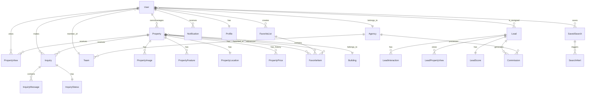

# Real Estate - Arquitectura Completa de la Plataforma Inmobiliaria

## 📌 IMPORTANTE: Instrucciones para Claude Code

Este documento es tu guía maestra para implementar la plataforma "Real Estate". Contiene toda la arquitectura, decisiones técnicas y de negocio. 

**REGLAS FUNDAMENTALES:**
1. **SIEMPRE pregunta antes de tomar decisiones** no especificadas en este documento
2. **Mobile-first es CRÍTICO** - cada componente debe ser perfecto en móvil primero
3. **SEO y Performance** son prioridades absolutas en cada decisión
4. **Usa los ejemplos de código** como referencia, pero adáptalos al contexto
5. **Sigue el roadmap de fases** pero pregunta antes de empezar cada una

**ORDEN DE IMPLEMENTACIÓN:**
1. Comienza con la Fase 0 (Setup de infraestructura)
2. Crea la estructura de carpetas como se especifica
3. Implementa el schema de Prisma completo
4. Configura el sistema de diseño con los tokens especificados
5. Pregunta antes de continuar con la siguiente fase

---

## 🏗️ Visión General del Proyecto

### Objetivo Principal
Construir la plataforma inmobiliaria líder del país con enfoque en:
- **SEO Dominante**: Ser el #1 en rankings de búsqueda para real estate
- **UX/UI Excepcional**: Experiencia de usuario que supere a la competencia
- **Escalabilidad**: Arquitectura que soporte crecimiento exponencial
- **Diferenciación**: Features únicos para agentes y clientes

### Principios de Diseño
1. **Mobile-First**: 70% del tráfico inmobiliario es móvil
2. **Performance-Obsessed**: Cada milisegundo cuenta para SEO y conversión
3. **Design-Driven**: Interfaz que inspire confianza y profesionalismo
4. **Data-Centric**: Decisiones basadas en métricas y comportamiento de usuario

## 🛠️ Stack Tecnológico Completo

### Frontend

#### Core Technologies
- **Next.js 15 (App Router)** 
  - **Por qué**: Framework React con SSR/SSG nativo, crucial para SEO
  - **Uso**: Renderizado del lado del servidor para páginas de propiedades, generación estática para páginas institucionales
  - **Features clave**: Image optimization, font optimization, prefetching automático

- **TypeScript**
  - **Por qué**: Type safety reduce bugs en 40% según estudios
  - **Uso**: Todo el código frontend y backend
  - **Configuración**: Strict mode habilitado

- **Tailwind CSS + shadcn/ui**
  - **Por qué**: Desarrollo rápido con consistencia visual
  - **Uso**: Sistema de diseño unificado
  - **Customización**: Paleta de colores propia, componentes extendidos

- **Clerk** (Autenticación)
  - **Por qué**: Solución moderna, fácil integración con Next.js, mejor UX que Auth0
  - **Uso**: Autenticación dual (social para clientes, email para agentes)
  - **Features**: User management built-in, webhooks, metadata personalizable

#### State Management & Data Fetching
- **TanStack Query (React Query)**
  - **Por qué**: Caché inteligente, sincronización de servidor, gestión de estados de carga
  - **Uso**: Todas las llamadas API, invalidación automática de caché
  - **Ejemplo de uso**:
    ```typescript
    // Fetch de propiedades con caché automático
    const { data, isLoading } = useQuery({
      queryKey: ['properties', filters],
      queryFn: () => fetchProperties(filters),
      staleTime: 5 * 60 * 1000, // 5 minutos
    })
    ```

- **Zustand**
  - **Por qué**: Más simple que Redux, menos boilerplate, TypeScript nativo
  - **Uso**: Estado global de la app (usuario, preferencias, filtros activos)
  - **Stores planificados**:
    - `useAuthStore`: Estado de autenticación
    - `useFilterStore`: Filtros de búsqueda persistentes
    - `useUIStore`: Estado de UI (modales, sidebars)

#### Formularios y Validación
- **React Hook Form + Zod**
  - **Por qué**: Performance superior (menos re-renders), validación type-safe
  - **Uso**: Todos los formularios de la aplicación
  - **Schemas compartidos**: Backend y frontend usan los mismos schemas Zod

#### Herramientas Adicionales Sugeridas
- **Framer Motion**
  - **Uso**: Animaciones suaves para mejorar UX
  - **Casos**: Transiciones de página, micro-interacciones

- **react-intersection-observer**
  - **Uso**: Lazy loading de imágenes y componentes
  - **SEO benefit**: Mejora Core Web Vitals

- **next-seo**
  - **Uso**: Gestión centralizada de meta tags
  - **Features**: Open Graph, Twitter Cards, Schema.org

### Backend

#### Core Stack
- **Node.js + NestJS**
  - **Por qué**: Arquitectura empresarial, modular, inyección de dependencias
  - **Estructura**: Módulos por dominio (users, properties, notifications)

- **PostgreSQL + PostGIS**
  - **Por qué**: Base de datos relacional con soporte geoespacial nativo
  - **Uso**: Base de datos principal para todos los datos persistentes
  - **Features especiales**: 
    - Full-text search en español
    - Índices GiST para búsquedas por ubicación
    - JSONB para datos flexibles
  - **En Railway**: Se despliega como servicio independiente con PostGIS habilitado

- **Redis**
  - **Por qué**: Velocidad extrema para caché y colas
  - **Uso**: NO se vincula con PostgreSQL, trabajan independientemente
    - Caché de búsquedas frecuentes (TTL 5-15 minutos)
    - Sesiones de usuarios
    - Backend para BullMQ
    - Pub/Sub para eventos en tiempo real
  - **En Railway**: Servicio separado, ~$10-30/mes para comenzar
  - **Conexión**: Mediante `REDIS_URL` en variables de entorno

- **Prisma ORM**
  - **Por qué**: Type-safe, migraciones automáticas, excelente DX
  - **Uso**: Toda interacción con PostgreSQL
  - **Optimizaciones**: Incluir relaciones necesarias, evitar N+1

#### Caché y Colas

- **Redis**
  - **Por qué**: Velocidad extrema, versatilidad
  - **Uso**:
    - Caché de sesiones
    - Caché de búsquedas frecuentes
    - Rate limiting
    - Pub/Sub para eventos en tiempo real
  - **Costo**: ~$10-30/mes en Railway para comenzar
  - **Configuración sugerida**:
    ```typescript
    // Caché con TTL para búsquedas
    await redis.setex(
      `search:${searchHash}`, 
      300, // 5 minutos
      JSON.stringify(results)
    )
    ```

- **BullMQ**
  - **Por qué**: Colas robustas con reintentos, prioridades, scheduling
  - **Uso**:
    - Envío de emails (bienvenida, notificaciones)
    - Procesamiento de imágenes
    - Generación de reportes
    - Sincronización con servicios externos
  - **Costo**: Usa Redis como backend, sin costo adicional
  - **Ejemplo de job**:
    ```typescript
    // Job para procesar nueva propiedad
    await propertyQueue.add('process-new-property', {
      propertyId,
      agentId,
      tasks: ['optimize-images', 'notify-matches', 'index-search']
    })
    ```

### Autenticación y Autorización

#### ¿Por qué Clerk en lugar de Auth0?
- **Mejor integración con Next.js**: Componentes pre-construidos y hooks nativos
- **UX superior**: UI moderna y personalizable out-of-the-box
- **Gestión de metadata simple**: Fácil manejo de roles y permisos
- **Desarrollo más rápido**: Menos configuración, más features listas
- **Pricing más claro**: Modelo de precios predecible para startups

#### Clerk Configuration
- **Estrategia Dual**:
  - **Clientes**: Pueden usar social login (Google, Facebook) + email/password
  - **Agentes**: Solo email/password con verificación obligatoria
  
- **Configuración de Clerk**:
  ```typescript
  // Metadata de usuario en Clerk
  interface UserPublicMetadata {
    role: UserRole;
    agencyId?: string;
    teamId?: string;
  }
  
  // Roles del sistema
  enum UserRole {
    CLIENT = 'client',
    AGENT = 'agent',
    TEAM_LEADER = 'team_leader',
    OFFICE_MANAGER = 'office_manager',
    ADMIN = 'admin'
  }
  ```

- **Middleware de autorización**:
  ```typescript
  import { authMiddleware } from "@clerk/nextjs";
  
  export default authMiddleware({
    publicRoutes: ["/", "/propiedades", "/propiedades/(.*)"],
    ignoredRoutes: ["/api/webhooks(.*)"],
  });
  
  // Helper para verificar roles
  export const checkRole = (role: UserRole) => {
    return (user: User) => {
      const userRole = user.publicMetadata.role as UserRole;
      return roleHierarchy[userRole] >= roleHierarchy[role];
    };
  };
  ```

### Almacenamiento y Media

#### Alternativas a S3 (Considerando Costos)
1. **Cloudflare R2** (Recomendado)
   - **Costo**: $0.015/GB almacenado, NO cobra por requests
   - **Ventaja**: Integrado con CDN, sin costos de egreso
   - **Uso**: Todas las imágenes y documentos

2. **Backblaze B2**
   - **Costo**: $0.005/GB almacenado
   - **Ventaja**: Más económico que S3
   - **Contra**: Necesita CDN adicional

3. **Railway Volumes** (Para archivos pequeños)
   - **Costo**: Incluido en el plan
   - **Uso**: Archivos temporales, uploads en proceso

#### Procesamiento de Imágenes
```typescript
// Pipeline de optimización
const imageProcessingPipeline = {
  original: { quality: 90, format: 'webp' },
  thumbnail: { width: 300, height: 200, quality: 80 },
  gallery: { width: 800, height: 600, quality: 85 },
  hero: { width: 1920, height: 1080, quality: 90 }
}
```

### Notificaciones en Tiempo Real

#### Socket.io Implementation
```typescript
// Namespaces por tipo de usuario
io.of('/agents').use(agentAuthMiddleware)
io.of('/clients').use(clientAuthMiddleware)

// Rooms por contexto
socket.join(`agent:${agentId}`)
socket.join(`office:${officeId}`)
socket.join(`property:${propertyId}:watchers`)
```

### Integraciones Externas

#### Google Maps Integration
- **APIs a utilizar**:
  - Maps JavaScript API (mapas interactivos)
  - Places API (autocompletado de direcciones)
  - Geocoding API (convertir direcciones a coordenadas)
  - Street View API (vista de calle para propiedades)
  
- **Optimización de costos**:
  ```typescript
  // Caché de geocoding results
  const geocodeAddress = async (address: string) => {
    const cached = await redis.get(`geocode:${address}`)
    if (cached) return JSON.parse(cached)
    
    const result = await googleMaps.geocode(address)
    await redis.setex(`geocode:${address}`, 86400, JSON.stringify(result))
    return result
  }
  ```

#### Servicios de Email (Resend)
- **Templates planificados**:
  - Bienvenida (diferente para agentes/clientes)
  - Nueva propiedad matching criterios
  - Recordatorio de visita
  - Resumen semanal para agentes
  - Alertas de precio

## 🎯 Estrategia SEO Técnico

### Core Web Vitals Optimization
```typescript
// next.config.js optimizations
const nextConfig = {
  images: {
    formats: ['image/avif', 'image/webp'],
    deviceSizes: [640, 750, 828, 1080, 1200],
    minimumCacheTTL: 31536000,
  },
  compress: true,
  poweredByHeader: false,
}
```

### Schema.org Implementation
```typescript
// Componente para structured data
const PropertySchema = ({ property }) => (
  <script
    type="application/ld+json"
    dangerouslySetInnerHTML={{
      __html: JSON.stringify({
        "@context": "https://schema.org",
        "@type": "RealEstateListing",
        "name": property.title,
        "description": property.description,
        "offers": {
          "@type": "Offer",
          "price": property.price,
          "priceCurrency": "ARS"
        }
      })
    }}
  />
)
```

### URL Structure
```
/                           # Home
/propiedades               # Listado con filtros
/propiedades/[slug]        # Detalle de propiedad
/agentes                   # Directorio de agentes
/agentes/[id]              # Perfil de agente
/buscar                    # Búsqueda avanzada
/[ciudad]/[barrio]         # Landing pages locales para SEO
```

## 🎨 Referencias Visuales y Diseño

### Estrategia de Diseño
Vamos a crear **múltiples versiones** de componentes clave (Hero, secciones, cards) para que el cliente pueda elegir la dirección visual que prefiera. Cada versión tendrá un estilo diferente pero manteniendo la funcionalidad core.

### Referencias Online - Links de Inspiración

#### Portales Inmobiliarios de Referencia
- **Airbnb** (Mapas interactivos): https://www.airbnb.com/s/Buenos-Aires/homes
- **Zillow** (Cards y filtros): https://www.zillow.com/homes/
- **Rightmove UK** (Sistema de búsqueda): https://www.rightmove.co.uk/
- **Redfin** (Datos y analytics): https://www.redfin.com/
- **Compass** (Diseño premium): https://www.compass.com/
- **Idealista España** (UX mobile): https://www.idealista.com/

#### Competencia Local (Argentina)
- **ZonaProp**: https://www.zonaprop.com.ar/
- **MercadoLibre Inmuebles**: https://inmuebles.mercadolibre.com.ar/
- **Argenprop**: https://www.argenprop.com/
- **Properati**: https://www.properati.com.ar/

#### Inspiración de Otros Sectores
- **Booking.com** (Filtros y urgencia): https://www.booking.com/
- **Autotrader** (Búsqueda compleja): https://www.autotrader.com/
- **Spotify** (Mobile navigation): https://open.spotify.com/
- **Linear** (Dashboard limpio): https://linear.app/

### Diseños de Figma de Referencia

- **Real Estate Landing Page (Community)**: https://www.figma.com/design/Q9TR47AuFR0GVBaefwqUsb/Real-Estate-Landing-Page--Community-
  - Diseño moderno y limpio, excelente jerarquía visual
  - Hero section con búsqueda prominente
  - Cards de propiedades minimalistas

- **Real Estate Landing Web (Community)**: https://www.figma.com/design/tk9ZjKxd8wbiXjVZj3ocKg/Real-Estate-Landing-Web--Community-
  - Enfoque en fotografía grande
  - Navegación clara y CTAs destacados
  - Sección de agentes bien diseñada

- **75+ Real Estate Landing Templates**: https://www.figma.com/design/p8hHNghfQensZS9klF37O2/75--Real-Estate-Landing-website-templates--Community-
  - Múltiples variaciones de componentes
  - Diferentes estilos de hero sections
  - Variedad de layouts para inspiración

- **Real Estate Dark Theme UI**: https://www.figma.com/design/oJYoGidHYZ0oS3CO1USjK0/Real-Estate-Business-Website-UI-Template---Dark-Theme-%7C-Produce-UI--Community-
  - Ejemplo de tema oscuro elegante
  - Uso interesante de contrastes
  - Podría adaptarse para modo nocturno

- **Estatery - Real Estate SaaS Kit**: https://www.figma.com/design/tAdCN5dknCNAFgw18mliWK/-FREE--Estatery---Real-Estate-SaaS-Web-and-Mobile-UI-Kit--Community-
  - **Kit completo web y mobile** (muy útil para consistencia)
  - Componentes reutilizables bien estructurados
  - Sistema de diseño completo con variables
  - Excelentes ejemplos de responsive design

### Elementos Clave a Extraer de los Diseños de Figma

#### Del Kit Estatery (Principal referencia):
- **Sistema de cards responsive**: Adaptación perfecta desktop → tablet → mobile
- **Componente de búsqueda avanzada**: Con sugerencias y filtros rápidos
- **Dashboard de agente**: Layout limpio para gestión de propiedades
- **Sistema de navegación mobile**: Bottom tabs + gestos

#### De los Landing Pages:
- **Diferentes estilos de Hero**: Para crear nuestras 3 variantes
- **Secciones de confianza**: Testimonios, estadísticas, logos
- **CTAs flotantes en mobile**: Botón de contacto siempre visible
- **Micro-animaciones**: Hover states y transiciones suaves

#### Adaptaciones Necesarias:
- Argentinizar el contenido (precios en ARS, términos locales)
- Optimizar para nuestro volumen (250-400 propiedades)
- Integrar nuestro sistema de búsquedas inversas
- Mantener coherencia entre versiones light/dark
```
/design-system/
├── references/
│   ├── competitors/
│   ├── inspiration/
│   └── components/
├── variants/
│   ├── hero-v1-modern/
│   ├── hero-v2-classic/
│   ├── hero-v3-bold/
│   ├── property-card-v1-minimal/
│   ├── property-card-v2-detailed/
│   └── property-card-v3-visual/
└── selected/  # Las versiones finales elegidas
```

### Componentes con Múltiples Variantes

#### 1. Hero Section (3 variantes)
**Variante A - Modern Minimal**
- Búsqueda prominente sobre imagen full-width
- Estilo: Airbnb-inspired
- Foco: Simplicidad y claridad

**Variante B - Data Driven**
- Split: búsqueda + estadísticas del mercado
- Estilo: Compass/Redfin-inspired  
- Foco: Credibilidad y datos

**Variante C - Map Focused**
- Mapa interactivo como hero
- Estilo: Zillow-inspired
- Foco: Exploración visual

#### 2. Property Cards (3 variantes)
**Variante A - Image Forward**
- Imagen grande, información mínima
- Hover reveal para más datos
- Mobile: Swipe para más fotos

**Variante B - Information Rich**
- Balance imagen/datos
- Todos los datos clave visibles
- Badges y tags prominentes

**Variante C - Interactive**
- Acciones rápidas visibles
- Comparador integrado
- Mini-mapa en la card

#### 3. Search Results Layout (3 variantes)
**Variante A - List Focus**
- Lista principal, mapa secundario
- Toggle para cambiar vistas
- Filtros colapsables

**Variante B - Split View**
- 50/50 lista y mapa
- Sincronización en hover
- Filtros superiores

**Variante C - Map First**
- Mapa grande con cards overlay
- Lista en drawer móvil
- Filtros flotantes

### Principios Extraídos de Referencias

#### De la Competencia Internacional
- **Airbnb**: Fotografía como protagonista, mapas fluidos
- **Zillow**: Información densa pero organizada
- **Compass**: Diseño premium, tipografía elegante
- **Rightmove**: Filtros potentes pero simples

#### De la Competencia Local  
- **ZonaProp**: Familiaridad del usuario argentino
- **MercadoLibre**: Confianza y sistema de filtros conocido
- **Evitar**: Diseños recargados, demasiados banners

### Elementos UI Específicos a Implementar

#### Basados en Referencias
1. **Search Bar** (inspirado en Airbnb + Google)
   - Autocompletado inteligente
   - Búsquedas recientes
   - Chips de filtros rápidos

2. **Map Interactions** (inspirado en Zillow + Rightmove)
   - Clusters dinámicos
   - Preview cards on hover
   - Dibujar área de búsqueda

3. **Filter System** (inspirado en Booking + MercadoLibre)
   - Filtros visuales con iconos
   - Contadores en tiempo real
   - Applied filters bar

4. **Mobile Navigation** (inspirado en Spotify + Instagram)
   - Bottom tab navigation
   - Gestos nativos
   - Transiciones fluidas

### Proceso de Selección de Variantes

1. **Fase 2**: Implementar las 3 variantes de cada componente principal
2. **Fase 2.5**: Testing interno y con stakeholders
3. **Decisión**: Cliente elige una variante de cada componente
4. **Fase 3**: Implementar todo el sistema con las variantes elegidas

### Notas para Claude Code
- Implementar cada variante en un componente separado (ej: `HeroV1.tsx`, `HeroV2.tsx`)
- Usar un sistema de feature flags para cambiar entre variantes fácilmente
- Mantener la misma funcionalidad core en todas las variantes
- Documentar las diferencias clave entre cada variante

## 🎨 Sistema de Diseño

### Design Tokens
```typescript
// tailwind.config.ts
const designSystem = {
  colors: {
    primary: {
      50: '#eff6ff',
      500: '#3b82f6',
      900: '#1e3a8a'
    },
    success: { /* ... */ },
    warning: { /* ... */ },
    error: { /* ... */ }
  },
  spacing: {
    xs: '0.5rem',
    sm: '1rem',
    md: '1.5rem',
    lg: '2rem',
    xl: '3rem'
  }
}
```

### Componentes Core
- **PropertyCard**: Tarjeta de propiedad con lazy loading
- **FilterBar**: Barra de filtros sticky con estado persistente
- **MapView**: Vista de mapa con clusters
- **ImageGallery**: Galería optimizada con lightbox
- **ContactForm**: Formulario de contacto con validación

## 🎯 Funcionalidades Completas del Sistema

### 🏠 Portal Cliente (Público/Registrado)

#### 1. Sistema de Búsqueda y Navegación
La búsqueda es el corazón de cualquier portal inmobiliario. Necesitamos múltiples formas de acceso a las propiedades:

**Búsqueda Principal**
- **Búsqueda por texto libre**: Con autocompletado inteligente que sugiera direcciones, barrios, y tipos de propiedad
- **Búsqueda por mapa**: Dibujar polígonos, búsqueda por radio, vista de heat map de precios
- **Búsqueda por código de propiedad**: Acceso directo para usuarios que vieron publicidad offline

**Filtros Avanzados**
- **Ubicación**: País > Provincia > Ciudad > Barrio > Sub-barrio
- **Tipo de operación**: Venta, Alquiler, Alquiler temporal, Alquiler comercial
- **Tipo de propiedad**: 
  - Residencial: Departamento, Casa, PH, Loft, Quinta
  - Comercial: Local, Oficina, Galpón, Terreno
  - Especiales: Cochera, Fondo de comercio
- **Características físicas**:
  - Ambientes (1, 2, 3, 4+)
  - Dormitorios y baños
  - Superficie total y cubierta
  - Antigüedad del inmueble
  - Estado (A estrenar, Excelente, Muy bueno, Bueno, Regular)
- **Amenities**: 
  - Pileta, Gimnasio, SUM, Parrilla
  - Seguridad 24hs, Portero
  - Cochera (cubierta/descubierta)
  - Baulera
- **Precio**: Rangos con sliders, opción de "consultar precio"
- **Características especiales**:
  - Apto profesional
  - Apto mascotas
  - Accesible para personas con movilidad reducida
  - Vista al río/plaza/calle

**Ordenamiento de Resultados**
- Relevancia (algoritmo propio basado en múltiples factores)
- Precio (menor a mayor / mayor a menor)
- Superficie
- Fecha de publicación
- Más visitados

#### 2. Visualización de Propiedades

**Vista de Listado**
- **Modo grilla**: 2-3 columnas responsive con cards
- **Modo lista**: Una columna con más información visible
- **Modo mapa**: Mapa grande con pins y cards flotantes
- **Información en cards**:
  - Foto principal con indicador de cantidad de fotos
  - Precio y expensas
  - Ubicación (barrio y calle sin número exacto por seguridad)
  - Características principales (m², ambientes, baños)
  - Tags especiales (Oportunidad, Precio rebajado, Urgente)
  - Botón de favorito
  - Información del agente/inmobiliaria

**Vista de Detalle de Propiedad**
- **Galería de imágenes**: 
  - Carrusel principal con thumbnails
  - Vista fullscreen con zoom
  - Organización por ambientes
  - Tour virtual 360° (cuando esté disponible)
- **Información detallada**:
  - Descripción completa
  - Características generales y del edificio
  - Servicios incluidos
  - Expensas desglosadas
  - Estado de deudas
- **Ubicación**:
  - Mapa interactivo con Street View
  - Puntos de interés cercanos (colegios, hospitales, transporte)
  - Caminabilidad del barrio (walk score)
- **Calculadoras integradas**:
  - Simulador de crédito hipotecario
  - Calculadora de gastos de mudanza
  - Estimador de gastos mensuales totales

#### 3. Sistema de Usuario Registrado

**Gestión de Cuenta**
- **Perfil personal**: Datos básicos, preferencias de contacto
- **Verificación de identidad**: Para usuarios que publican (DNI, validación de email/teléfono)
- **Preferencias de búsqueda**: Guardar criterios predeterminados

**Favoritos**
- **Organización en listas personalizadas**: Carpetas temáticas como "Casas fin de semana", "Opciones trabajo"
- **Notas privadas por propiedad**: Comentarios personales en cada favorito
- **Comparador de propiedades**: Hasta 4 propiedades lado a lado
- **Compartir listas**: Generar link para compartir con familia/pareja

**Búsquedas Guardadas y Alertas**
- Guardar búsquedas con todos los filtros
- Alertas por email/push con frecuencia configurable
- Preview de nuevas propiedades en el dashboard
- Alertas de cambio de precio en favoritos

**Sistema de Búsquedas Inversas (Feature Diferenciador)**
- **Publicar lo que busco**: Los clientes crean un "anuncio" de lo que necesitan
- **Formulario inteligente**:
  - Tipo de operación y propiedad deseada
  - Presupuesto disponible
  - Zonas de interés (múltiples)
  - Características imprescindibles vs deseables
  - Urgencia/timeline
  - Preferencias especiales (ej: apto mascotas, cerca de colegios)
- **Matching automático**: Sistema notifica a agentes con propiedades compatibles
- **Privacy control**: Cliente decide qué información compartir
- **Dashboard de respuestas**: Ver qué agentes tienen opciones para mí
- **Ejemplo de UI**:
  ```typescript
  // Componente de búsqueda inversa
  const ReverseSearchForm = () => {
    return (
      <div className="max-w-2xl mx-auto p-6">
        <h2 className="text-2xl font-bold mb-6">
          Contanos qué estás buscando y dejá que las propiedades te encuentren
        </h2>
        
        <form className="space-y-6">
          {/* Tipo de operación */}
          <RadioGroup>
            <Label>Quiero...</Label>
            <RadioGroupItem value="rent">Alquilar</RadioGroupItem>
            <RadioGroupItem value="buy">Comprar</RadioGroupItem>
          </RadioGroup>
          
          {/* Presupuesto con slider */}
          <div>
            <Label>Mi presupuesto máximo es...</Label>
            <PriceRangeSlider 
              max={budgetMax}
              onChange={setBudget}
              showAffordability // Muestra qué % del mercado puede acceder
            />
          </div>
          
          {/* Zonas con mapa interactivo */}
          <div>
            <Label>Me interesa vivir en...</Label>
            <InteractiveMap 
              mode="multi-select"
              onAreasSelected={setSelectedAreas}
            />
            <TagList 
              tags={selectedAreas}
              onRemove={removeArea}
            />
          </div>
          
          {/* Características con priorización */}
          <div>
            <Label>Necesito...</Label>
            <div className="grid grid-cols-2 gap-4">
              <FeatureSelector 
                category="imprescindible"
                icon={<Star className="text-accent" />}
              />
              <FeatureSelector 
                category="deseable"
                icon={<Heart className="text-muted-foreground" />}
              />
            </div>
          </div>
          
          {/* Timeline */}
          <div>
            <Label>Necesito mudarme...</Label>
            <Select>
              <SelectItem value="asap">Lo antes posible</SelectItem>
              <SelectItem value="1month">En el próximo mes</SelectItem>
              <SelectItem value="3months">En los próximos 3 meses</SelectItem>
              <SelectItem value="flexible">Soy flexible</SelectItem>
            </Select>
          </div>
          
          {/* CTA principal */}
          <Button size="lg" className="w-full">
            Activar búsqueda y recibir propuestas
          </Button>
        </form>
      </div>
    );
  };
  ```

**Historial y Analytics Personal**
- Propiedades visitadas con timeline
- Estadísticas de búsqueda (qué busco más)
- Recomendaciones basadas en comportamiento

**Mis Contactos y Mensajes**
- Historial de conversaciones con agentes
- Estados de consultas (nueva, en proceso, visitada, cerrada)
- Calificación de agentes post-interacción
- Agenda de visitas programadas

#### 4. Publicación de Propiedades (Usuario Dueño Directo)

**Proceso de Publicación**
- **Wizard paso a paso**:
  1. Tipo de operación y propiedad
  2. Ubicación exacta con validación
  3. Características y amenities
  4. Upload de fotos con guía de mejores prácticas
  5. Precio y condiciones
  6. Revisión y publicación
- **Validaciones**: 
  - Verificación de propiedad (título, DNI)
  - Moderación de contenido
  - Sugerencias de precio basadas en mercado

**Gestión de Publicación**
- Dashboard de métricas (vistas, consultas, favoritos)
- Edición en cualquier momento
- Pausar/reactivar publicación
- Responder consultas

#### 5. Contenido Editorial y Herramientas

**Centro de Recursos**
- **Guías categorizadas**:
  - "Primer alquiler: Todo lo que necesitás saber"
  - "Requisitos para alquilar en 2024"
  - "Cómo comprar tu primera propiedad"
  - "Gastos de escrituración explicados"
- **Calculadoras y herramientas**:
  - Calculadora de sellado e impuestos
  - Checklist de mudanza
  - Modelo de contratos
- **Blog con SEO focus**:
  - Tendencias del mercado por zona
  - Análisis de barrios
  - Consejos de inversión

### 👔 Portal Agente Inmobiliario

#### 1. Dashboard Principal

El dashboard es el centro de comando del agente, diseñado para maximizar su productividad:

**Vista General (Home)**
- **KPIs en tiempo real**:
  - Leads nuevos hoy/semana/mes
  - Propiedades activas vs pausadas
  - Tasa de conversión de leads
  - Comisiones proyectadas vs cobradas
- **Actividad reciente**: Timeline de eventos importantes
- **Tareas pendientes**: Sistema de GTD (Getting Things Done) integrado
- **Calendario**: Visitas del día, recordatorios, vencimientos

#### 2. Gestión de Propiedades

**Creación y Edición Avanzada**
- **Importación masiva**: CSV/Excel con plantillas
- **Clonación de propiedades**: Para similares en el mismo edificio
- **Fichas técnicas profesionales**: 
  - Planos editables
  - Documentación legal
  - Historial de precio
- **Gestión multimedia avanzada**:
  - Banco de imágenes por edificio
  - Editor de fotos integrado
  - Ordenamiento drag & drop
  - Videos y tours virtuales

**Estados y Workflow**
- Estados: Borrador > En revisión > Activa > Reservada > Vendida/Alquilada
- Automatizaciones por estado (ej: enviar docs al cerrar)
- Historial completo de cambios

**Performance Analytics por Propiedad**
- Vistas únicas vs repetidas
- Origen del tráfico
- Tiempo promedio en página
- Tasa de consulta
- Comparación con propiedades similares

#### 3. CRM Integrado

**Gestión de Contactos**
- **Perfil unificado del cliente**:
  - Datos personales y de contacto
  - Preferencias de búsqueda explícitas e implícitas
  - Historial de interacciones
  - Scoring de calidad del lead
  - Documentos asociados
- **Segmentación inteligente**:
  - Por estado en el funnel
  - Por tipo de operación buscada
  - Por urgencia
  - Por capacidad económica

**Pipeline de Ventas**
- **Etapas personalizables**: 
  - Nuevo lead > Calificado > Primera visita > Negociación > Cierre
- **Acciones por etapa**: 
  - Templates de email
  - Tareas automáticas
  - Recordatorios
- **Forecasting**: Predicción de cierres basada en histórico

**Comunicación Multicanal**
- Email integrado con templates
- WhatsApp Business API
- SMS para confirmaciones
- Llamadas con registro automático

#### 4. Herramientas de Productividad

**Matching Inteligente**
- Algoritmo que cruza propiedades con clientes
- Sugerencias de match con explicación
- Envío masivo de matches personalizados

**Tasador Automático (CMA - Comparative Market Analysis)**
- **Inputs del sistema**:
  - Propiedades vendidas en la zona (último año)
  - Propiedades activas similares
  - Tendencias de precio por m²
  - Ajustes por amenities y estado
- **Output profesional**: 
  - Informe PDF con logo de la inmobiliaria
  - Rango de precio sugerido
  - Comparables con fotos

**Generador de Reportes**
- Reporte de actividad para propietarios
- Análisis de mercado por zona
- Performance personal/equipo

**Agenda Inteligente**
- Scheduling automático de visitas
- Ruteo optimizado para visitas múltiples
- Confirmaciones automáticas
- Sincronización con calendario personal

#### 5. Gestión de Equipo (Team Leaders y Office Managers)

**Para Team Leaders**
- **Dashboard de equipo**:
  - Performance individual y comparativa
  - Distribución de leads (manual o automática)
  - Objetivos y cumplimiento
- **Herramientas de coaching**:
  - Grabación de llamadas para training
  - Biblioteca de mejores prácticas
  - Sistema de mentorías

**Para Office Managers**
- **Gestión de inventario**: 
  - Todas las propiedades de la oficina
  - Asignación de responsables
  - Control de exclusividades
- **Reportes gerenciales**:
  - P&L por agente/equipo
  - Proyecciones de comisiones
  - ROI por fuente de leads
- **Administración**:
  - Alta/baja de agentes
  - Gestión de comisiones y splits
  - Configuración de workflows

#### 6. Herramientas de Marketing

**Marketing de Propiedades**
- **Publicación multicanal**: Un click para publicar en todos los portales
- **Creador de flyers**: Templates profesionales
- **QR codes**: Para cada propiedad con tracking
- **Email marketing**: Campañas segmentadas

**Marketing Personal**
- **Mini-site del agente**: Página personal con propiedades
- **Tarjetas digitales**: Con vCard descargable
- **Social media kit**: Imágenes optimizadas para cada red

### 💰 Sistema de Leads y Comisiones

**Gestión de Leads**
- **Fuentes rastreables**:
  - Portal propio
  - Portales externos (con UTM)
  - Redes sociales
  - Referidos
  - Walk-ins
- **Scoring automático basado en**:
  - Completitud del perfil
  - Interacciones
  - Propiedades vistas
  - Respuesta a comunicaciones
- **Reglas de asignación**:
  - Round robin
  - Por zona geográfica
  - Por tipo de propiedad
  - Por performance del agente

**Sistema de Comisiones**
- **Configuración flexible**:
  - Porcentajes por tipo de operación
  - Splits variables por seniority
  - Bonificaciones por objetivos
- **Tracking completo**:
  - Desde lead hasta cobro
  - Estados: Proyectada > Confirmada > Facturada > Cobrada
- **Reportes y proyecciones**:
  - Comisiones por cobrar
  - Histórico de cobros
  - Proyección mensual/anual

## 📊 Modelo de Datos Completo

### Diagrama de Entidades y Relaciones



### Esquema Detallado de Base de Datos

```prisma
// ==================== USUARIOS Y AUTENTICACIÓN ====================

model User {
  id                String      @id @default(cuid())
  email             String      @unique
  emailVerified     DateTime?
  clerkId           String?     @unique // ID de Clerk
  role              UserRole    @default(CLIENT)
  status            UserStatus  @default(ACTIVE)
  createdAt         DateTime    @default(now())
  updatedAt         DateTime    @updatedAt
  lastLoginAt       DateTime?
  
  // Relaciones
  profile           Profile?
  properties        Property[]  @relation("PropertyAgent") // Solo para agentes
  favoriteLists     FavoriteList[]
  savedSearches     SavedSearch[]
  inquiries         Inquiry[]   @relation("UserInquiries")
  propertyViews     PropertyView[]
  notifications     Notification[]
  
  // Relaciones de agente
  agencyId          String?
  agency            Agency?     @relation(fields: [agencyId], references: [id])
  teamId            String?
  team              Team?       @relation(fields: [teamId], references: [id])
  assignedLeads     Lead[]      @relation("AssignedAgent")
  commissions       Commission[] @relation("AgentCommissions")
  
  @@index([email])
  @@index([clerkId])
  @@index([role])
  @@index([agencyId])
}

enum UserRole {
  CLIENT
  AGENT
  TEAM_LEADER
  OFFICE_MANAGER
  ADMIN
  SUPER_ADMIN
}

enum UserStatus {
  ACTIVE
  INACTIVE
  SUSPENDED
  DELETED
}

model Profile {
  id                String      @id @default(cuid())
  userId            String      @unique
  user              User        @relation(fields: [userId], references: [id])
  
  // Información personal
  firstName         String
  lastName          String
  phone             String?
  phoneVerified     Boolean     @default(false)
  secondaryPhone    String?
  profileImage      String?
  bio               String?     // Para agentes
  
  // Documentos
  documentType      DocumentType?
  documentNumber    String?
  documentVerified  Boolean     @default(false)
  
  // Preferencias
  contactPreference ContactMethod @default(EMAIL)
  language          String      @default("es")
  timezone          String      @default("America/Argentina/Buenos_Aires")
  
  // Datos de agente
  licenseNumber     String?     // Matrícula profesional
  specializations   String[]    // Tipos de propiedades que maneja
  areasOfOperation  String[]    // Zonas donde opera
  yearsOfExperience Int?
  
  createdAt         DateTime    @default(now())
  updatedAt         DateTime    @updatedAt
  
  @@index([documentNumber])
}

// ==================== PROPIEDADES ====================

model Property {
  id                String      @id @default(cuid())
  code              String      @unique // Código único visible
  slug              String      @unique // URL amigable
  status            PropertyStatus @default(DRAFT)
  
  // Información básica
  title             String
  description       String      @db.Text
  operationType     OperationType
  propertyType      PropertyType
  propertySubtype   String?     // Subtipo específico
  
  // Relaciones
  agentId           String
  agent             User        @relation("PropertyAgent", fields: [agentId], references: [id])
  agencyId          String?
  agency            Agency?     @relation(fields: [agencyId], references: [id])
  buildingId        String?
  building          Building?   @relation(fields: [buildingId], references: [id])
  
  // Componentes
  location          PropertyLocation?
  prices            PropertyPrice[]
  images            PropertyImage[]
  features          PropertyFeature[]
  
  // Interacciones
  views             PropertyView[]
  inquiries         Inquiry[]
  favoriteItems     FavoriteItem[]
  
  // Metadata
  publishedAt       DateTime?
  featuredUntil     DateTime?   // Para destacados
  createdAt         DateTime    @default(now())
  updatedAt         DateTime    @updatedAt
  
  // SEO
  metaTitle         String?
  metaDescription   String?
  
  @@index([status])
  @@index([operationType])
  @@index([propertyType])
  @@index([agentId])
  @@index([publishedAt])
  @@index([slug])
}

model PropertyLocation {
  id                String      @id @default(cuid())
  propertyId        String      @unique
  property          Property    @relation(fields: [propertyId], references: [id], onDelete: Cascade)
  
  // Dirección
  country           String      @default("Argentina")
  province          String
  city              String
  neighborhood      String
  subNeighborhood   String?
  street            String
  streetNumber      String
  floor             String?
  apartment         String?
  postalCode        String?
  
  // Coordenadas (PostGIS point)
  latitude          Float
  longitude         Float
  
  // Información adicional
  hideExactAddress  Boolean     @default(false)
  transportNearby   Json?       // Array de transportes cercanos
  poisNearby        Json?       // Points of interest
  
  @@index([city])
  @@index([neighborhood])
  @@index([latitude, longitude])
}

model PropertyPrice {
  id                String      @id @default(cuid())
  propertyId        String
  property          Property    @relation(fields: [propertyId], references: [id], onDelete: Cascade)
  
  amount            Decimal     @db.Decimal(12, 2)
  currency          Currency    @default(ARS)
  
  // Para alquileres
  expensesAmount    Decimal?    @db.Decimal(10, 2)
  
  // Historial
  validFrom         DateTime    @default(now())
  validTo           DateTime?
  isActive          Boolean     @default(true)
  
  createdAt         DateTime    @default(now())
  
  @@index([propertyId])
  @@index([isActive])
}

model PropertyFeature {
  id                String      @id @default(cuid())
  propertyId        String
  property          Property    @relation(fields: [propertyId], references: [id], onDelete: Cascade)
  
  category          FeatureCategory
  
  // Características generales
  totalArea         Float?      // m² totales
  coveredArea       Float?      // m² cubiertos
  rooms             Int?        // Ambientes
  bedrooms          Int?
  bathrooms         Int?
  toilettes         Int?
  
  // Características específicas
  garages           Int?
  garageType        String?     // Cubierta, Descubierta
  
  // Amenities (almacenado como JSON array)
  amenities         Json?       // ["pool", "gym", "security24h"]
  
  // Estado y antigüedad
  condition         PropertyCondition?
  age               Int?        // Años de antigüedad
  orientation       String?     // Norte, Sur, Este, Oeste
  
  // Otros datos estructurados
  customFeatures    Json?       // Para features no estándar
  
  @@index([propertyId])
}

// ==================== FAVORITOS Y BÚSQUEDAS ====================

model FavoriteList {
  id                String      @id @default(cuid())
  userId            String
  user              User        @relation(fields: [userId], references: [id])
  
  name              String
  description       String?
  isDefault         Boolean     @default(false)
  
  items             FavoriteItem[]
  
  createdAt         DateTime    @default(now())
  updatedAt         DateTime    @updatedAt
  
  @@unique([userId, name])
  @@index([userId])
}

model FavoriteItem {
  id                String      @id @default(cuid())
  listId            String
  list              FavoriteList @relation(fields: [listId], references: [id], onDelete: Cascade)
  propertyId        String
  property          Property    @relation(fields: [propertyId], references: [id])
  
  notes             String?     @db.Text // Notas privadas del usuario
  addedAt           DateTime    @default(now())
  
  @@unique([listId, propertyId])
  @@index([propertyId])
}

model SavedSearch {
  id                String      @id @default(cuid())
  userId            String
  user              User        @relation(fields: [userId], references: [id])
  
  name              String
  filters           Json        // Todos los filtros de búsqueda
  
  // Configuración de alertas
  alertEnabled      Boolean     @default(true)
  alertFrequency    AlertFrequency @default(DAILY)
  lastAlertSent     DateTime?
  
  alerts            SearchAlert[]
  
  createdAt         DateTime    @default(now())
  updatedAt         DateTime    @updatedAt
  
  @@index([userId])
  @@index([alertEnabled])
}

// ==================== LEADS Y CRM ====================

model Lead {
  id                String      @id @default(cuid())
  
  // Información básica
  firstName         String
  lastName          String
  email             String
  phone             String?
  
  // Origen y asignación
  source            LeadSource
  sourceDetails     Json?       // UTMs, campaña, etc
  assignedAgentId   String?
  assignedAgent     User?       @relation("AssignedAgent", fields: [assignedAgentId], references: [id])
  assignedAt        DateTime?
  
  // Estado y calificación
  status            LeadStatus  @default(NEW)
  score             LeadScore?
  
  // Datos de búsqueda
  operationType     OperationType?
  propertyTypes     String[]
  budgetMin         Decimal?    @db.Decimal(12, 2)
  budgetMax         Decimal?    @db.Decimal(12, 2)
  preferredAreas    String[]
  requirements      String?     @db.Text
  
  // Actividad
  interactions      LeadInteraction[]
  propertyViews     LeadPropertyView[]
  commissions       Commission[]
  
  // Metadata
  createdAt         DateTime    @default(now())
  updatedAt         DateTime    @updatedAt
  lastContactAt     DateTime?
  
  @@index([email])
  @@index([assignedAgentId])
  @@index([status])
  @@index([createdAt])
}

model LeadScore {
  id                String      @id @default(cuid())
  leadId            String      @unique
  lead              Lead        @relation(fields: [leadId], references: [id])
  
  // Componentes del score
  profileScore      Int         // Completitud del perfil
  engagementScore   Int         // Interacciones
  intentScore       Int         // Señales de intención
  totalScore        Int         // Score total calculado
  
  // Factores considerados
  factors           Json        // Detalle de cómo se calculó
  
  calculatedAt      DateTime    @default(now())
  
  @@index([totalScore])
}

// ==================== COMUNICACIÓN ====================

model Inquiry {
  id                String      @id @default(cuid())
  
  // Participantes
  userId            String
  user              User        @relation("UserInquiries", fields: [userId], references: [id])
  propertyId        String
  property          Property    @relation(fields: [propertyId], references: [id])
  agentId           String
  agent             User        @relation(fields: [agentId], references: [id])
  
  // Estado
  status            InquiryStatus
  statusHistory     Json        // Array de cambios de estado
  
  // Contenido
  initialMessage    String      @db.Text
  messages          InquiryMessage[]
  
  // Metadata
  source            String?     // De dónde vino la consulta
  createdAt         DateTime    @default(now())
  updatedAt         DateTime    @updatedAt
  lastMessageAt     DateTime?
  
  @@index([userId])
  @@index([propertyId])
  @@index([agentId])
  @@index([status])
}

// ==================== AGENCIAS Y EQUIPOS ====================

model Agency {
  id                String      @id @default(cuid())
  name              String
  slug              String      @unique
  
  // Información
  description       String?     @db.Text
  logo              String?
  website           String?
  email             String
  phone             String
  
  // Dirección
  address           Json
  
  // Configuración
  settings          Json        // Configuraciones específicas
  commissionRules   Json        // Reglas de comisión
  
  // Relaciones
  users             User[]
  teams             Team[]
  properties        Property[]
  commissions       Commission[]
  
  // Estado
  status            AgencyStatus @default(ACTIVE)
  verifiedAt        DateTime?
  
  createdAt         DateTime    @default(now())
  updatedAt         DateTime    @updatedAt
  
  @@index([slug])
}

model Team {
  id                String      @id @default(cuid())
  agencyId          String
  agency            Agency      @relation(fields: [agencyId], references: [id])
  
  name              String
  description       String?
  
  // Líder del equipo
  leaderId          String
  members           User[]
  
  // Configuración
  settings          Json        // Permisos, configuraciones
  
  createdAt         DateTime    @default(now())
  updatedAt         DateTime    @updatedAt
  
  @@index([agencyId])
}

// ==================== COMISIONES ====================

model Commission {
  id                String      @id @default(cuid())
  
  // Relaciones
  propertyId        String
  property          Property    @relation(fields: [propertyId], references: [id])
  agentId           String
  agent             User        @relation("AgentCommissions", fields: [agentId], references: [id])
  agencyId          String?
  agency            Agency?     @relation(fields: [agencyId], references: [id])
  leadId            String?
  lead              Lead?       @relation(fields: [leadId], references: [id])
  
  // Montos
  saleAmount        Decimal     @db.Decimal(12, 2)
  commissionRate    Decimal     @db.Decimal(5, 2) // Porcentaje
  grossCommission   Decimal     @db.Decimal(10, 2)
  agentSplit        Decimal     @db.Decimal(5, 2) // Porcentaje para el agente
  netCommission     Decimal     @db.Decimal(10, 2) // Lo que recibe el agente
  
  // Estado
  status            CommissionStatus @default(PROJECTED)
  
  // Fechas importantes
  projectedDate     DateTime
  confirmedDate     DateTime?
  invoicedDate      DateTime?
  paidDate          DateTime?
  
  // Metadata
  notes             String?     @db.Text
  createdAt         DateTime    @default(now())
  updatedAt         DateTime    @updatedAt
  
  @@index([agentId])
  @@index([status])
  @@index([projectedDate])
}

// ==================== ANALYTICS ====================

model PropertyView {
  id                String      @id @default(cuid())
  propertyId        String
  property          Property    @relation(fields: [propertyId], references: [id])
  
  // Viewer info
  userId            String?     // Null para visitantes anónimos
  user              User?       @relation(fields: [userId], references: [id])
  sessionId         String      // Para tracking anónimo
  ipAddress         String?
  
  // Contexto
  source            String?     // Referrer, UTM source
  device            String?     // Mobile, Desktop, Tablet
  
  // Engagement
  duration          Int?        // Segundos en la página
  interactions      Json?       // Clicks, scrolls, etc
  
  viewedAt          DateTime    @default(now())
  
  @@index([propertyId])
  @@index([userId])
  @@index([viewedAt])
}

// ==================== NOTIFICACIONES ====================

model Notification {
  id                String      @id @default(cuid())
  userId            String
  user              User        @relation(fields: [userId], references: [id])
  
  type              NotificationType
  title             String
  message           String      @db.Text
  data              Json?       // Datos adicionales según el tipo
  
  // Estado
  read              Boolean     @default(false)
  readAt            DateTime?
  
  // Entrega
  channels          String[]    // ["email", "push", "in_app"]
  deliveryStatus    Json        // Estado por canal
  
  createdAt         DateTime    @default(now())
  
  @@index([userId])
  @@index([read])
  @@index([createdAt])
}

// ==================== ENUMS ====================

enum OperationType {
  SALE
  RENT
  TEMPORARY_RENT
  COMMERCIAL_RENT
}

enum PropertyType {
  APARTMENT
  HOUSE
  PH
  LOFT
  COUNTRY_HOUSE
  LAND
  OFFICE
  STORE
  WAREHOUSE
  GARAGE
  BUSINESS
}

enum PropertyStatus {
  DRAFT
  PENDING_REVIEW
  ACTIVE
  PAUSED
  RESERVED
  SOLD
  RENTED
}

enum PropertyCondition {
  NEW
  EXCELLENT
  VERY_GOOD
  GOOD
  REGULAR
  TO_RENOVATE
}

enum Currency {
  ARS
  USD
}

enum FeatureCategory {
  GENERAL
  BUILDING
  UNIT
}

enum LeadSource {
  PORTAL
  FACEBOOK
  INSTAGRAM
  GOOGLE_ADS
  REFERRAL
  WALK_IN
  PHONE
  OTHER
}

enum LeadStatus {
  NEW
  CONTACTED
  QUALIFIED
  VISITING
  NEGOTIATING
  CLOSED_WON
  CLOSED_LOST
}

enum InquiryStatus {
  OPEN
  IN_PROGRESS
  AWAITING_RESPONSE
  SCHEDULED_VISIT
  CLOSED
}

enum AlertFrequency {
  IMMEDIATE
  DAILY
  WEEKLY
  MONTHLY
}

enum CommissionStatus {
  PROJECTED
  CONFIRMED
  INVOICED
  PAID
  CANCELLED
}

enum NotificationType {
  NEW_LEAD
  NEW_INQUIRY
  PRICE_CHANGE
  NEW_MATCH
  VISIT_REMINDER
  COMMISSION_UPDATE
  SYSTEM
}

enum ContactMethod {
  EMAIL
  PHONE
  WHATSAPP
  SMS
}

enum DocumentType {
  DNI
  PASSPORT
  CUIT
}

enum AgencyStatus {
  ACTIVE
  INACTIVE
  SUSPENDED
}
```

### Estrategia de Búsqueda Geoespacial con PostGIS

### Índices y Optimizaciones de Performance

Para garantizar que nuestra aplicación sea rápida incluso con millones de propiedades, necesitamos una estrategia de índices bien pensada:

```sql
-- Índices compuestos para búsquedas frecuentes
CREATE INDEX idx_property_search ON property(status, operation_type, property_type, published_at DESC);
CREATE INDEX idx_property_location ON property_location(city, neighborhood);
CREATE INDEX idx_property_price_active ON property_price(property_id, is_active, amount);

-- Índices para búsquedas geoespaciales (PostGIS)
CREATE INDEX idx_location_geography ON property_location USING GIST(geom);

-- Índice para búsquedas por proximidad con precio
CREATE INDEX idx_location_price_search ON property_location(geom) 
INCLUDE (property_id) 
WHERE property_id IN (
  SELECT property_id FROM property WHERE status = 'ACTIVE'
);

-- Índices de texto completo para búsquedas
CREATE INDEX idx_property_search_text ON property USING GIN(
  to_tsvector('spanish', title || ' ' || description)
);

-- Índices para queries de analytics
CREATE INDEX idx_views_daily ON property_view(property_id, viewed_at);
CREATE INDEX idx_commission_agent_status ON commission(agent_id, status, projected_date);

-- Índices para sincronización con Odoo
CREATE INDEX idx_external_refs ON lead((external_references->>'odooId')) WHERE external_references IS NOT NULL;
```

### Consideraciones de Diseño

#### 1. **Separación de Concerns**
Cada entidad tiene una responsabilidad clara. Por ejemplo, `PropertyPrice` está separado de `Property` para mantener un historial de precios, lo cual es valioso tanto para análisis como para mostrar la evolución del precio a los usuarios.

#### 2. **Flexibilidad con JSON**
Usamos campos JSON en lugares estratégicos (como `amenities`, `customFeatures`) para permitir flexibilidad sin necesidad de migraciones constantes cuando aparezcan nuevos tipos de amenities o características.

#### 3. **Soft Deletes Implícitos**
En lugar de borrar registros, usamos estados (`DELETED`, `INACTIVE`) para mantener la integridad referencial y permitir auditorías.

#### 4. **Historial y Trazabilidad**
Entidades como `PropertyPrice`, `InquiryStatus`, y `LeadInteraction` mantienen historial completo para análisis y transparencia.

#### 5. **Optimización para Lecturas**
Como en una plataforma inmobiliaria hay muchas más lecturas que escrituras, el diseño favorece queries eficientes aunque esto signifique algo de desnormalización controlada.

#### 6. **Escalabilidad Horizontal**
El diseño permite particionamiento futuro por:
- Fecha (para datos históricos)
- Ubicación geográfica (cuando crezcamos nacionalmente)
- Tipo de usuario (clientes vs agentes)

### Relaciones Clave Explicadas

**User ↔ Property**: Un usuario (agente) puede gestionar múltiples propiedades, pero cada propiedad tiene un único agente responsable.

**User ↔ FavoriteList ↔ Property**: Los usuarios pueden organizar sus propiedades favoritas en listas personalizadas (como "Casas para fin de semana" o "Opciones cerca del trabajo").

**Lead ↔ Commission**: Cada lead que se convierte genera una comisión, permitiendo trackear el ROI completo desde la captación hasta el cierre.

**Agency ↔ Team ↔ User**: Estructura jerárquica que permite gestionar permisos y visibilidad de datos según el rol organizacional.

Este modelo de datos está diseñado para soportar todas las funcionalidades que definimos, manteniendo la flexibilidad para crecer y adaptarse a nuevos requerimientos del negocio.

## 📍 Definiciones de Negocio y Alcance

### Alcance Geográfico
- **Cobertura**: Todo el territorio argentino desde el día 1
- **Foco principal**: AMBA (Área Metropolitana de Buenos Aires)
- **Expansión**: No hay planes de expansión internacional
- **Datos disponibles**: Ya contamos con coordenadas de propiedades

### Modelo de Operación
- **Volumen estimado**: 250-400 propiedades activas permanentemente
- **Tipos de propiedades**: Todas, incluyendo desarrollos, en pozo y finalizados
- **Moderación de contenido**: Validación por usuarios de nivel superior antes de publicar
- **Actualización de propiedades**: Los agentes actualizan desde mobile en el lugar

### Sistema de Leads y Consultas
- **Asignación de leads**: Automática al agente dueño de la propiedad consultada
- **Consultas genéricas**: Sistema de distribución para consultas sin propiedad específica
- **Búsquedas inversas**: Los clientes publican lo que buscan, los agentes los contactan si tienen match
- **Objetivo principal**: Maximizar la generación de leads mediante UX/UI superior y matching eficiente

### Información de Propiedades
- **Dirección**: Número de calle puede ser público (sin restricciones)
- **Precios**: Algunos pueden mostrar "A Consultar" 
- **Estados/Badges**: "Nuevo", "A Estrenar", "Reservado", etc. (algunos informativos, otros para engagement)
- **Contenido**: Título y descripción creados por el agente (IA modular para el futuro)

### Features Confirmados
- **Calculadora de hipotecas**: 100% confirmada
- **Tours 360°**: Por definir
- **Chat en vivo**: No inicialmente, posible integración futura
- **Personalización con muebles (AR)**: Feature diferenciador para el futuro
- **Validación con IA**: Para fotos y sugerencias (modular, activable cuando se decida)

### KPIs Principales
- Generación de Leads
- Visitas a propiedades
- Tasa de Conversión
- Tiempo en el Sitio
- Usuarios Activos
- Favoritos mantenidos
- Tasa de respuesta de agentes

### Integraciones Confirmadas
- **Autenticación**: Clerk (gestión de usuarios, roles y permisos)
- **Mapas**: Google Maps (para visualización, geocoding y street view)
- **Calendarios**: Google Calendar de cada agente (no integrado inicialmente)
- **Email**: Resend para notificaciones transaccionales
- **Almacenamiento**: Cloudflare R2 para imágenes

### Decisiones Técnicas Pendientes
- Sistema de comisiones (detalles por definir)
- Origen del tráfico por plataforma inmobiliaria (a investigar)

## 🔧 Configuración para Claude Code

### ⚠️ IMPORTANTE: Instrucciones de Comunicación
**Claude Code debe preguntar SIEMPRE cualquier duda o decisión técnica antes de implementar**. No asumas nada - es mejor preguntar y estar seguro que tener que rehacer trabajo. Específicamente consultar sobre:
- Decisiones de arquitectura o diseño
- Nombres de variables, funciones o componentes si no están claros
- Integraciones con servicios externos
- Cualquier aspecto del modelo de negocio que no esté explícito
- Optimizaciones que puedan afectar la funcionalidad

### Instrucciones para el Agente
1. **Prioridad SEO**: Cada decisión debe considerar impacto en SEO
2. **Performance First**: Optimizar bundle size, lazy loading agresivo
3. **Type Safety**: No usar 'any', interfaces para todo
4. **Testing**: Tests para features críticas
5. **Documentación**: Comentarios en código complejo
6. **Preguntar siempre**: Ante cualquier duda, consultar antes de implementar

### Estructura de Carpetas
```
real-estate/
├── app/                    # Next.js App Router
│   ├── (marketing)/       # Rutas públicas
│   ├── (dashboard)/       # Rutas autenticadas
│   └── api/               # API routes
├── components/
│   ├── ui/                # shadcn components
│   ├── features/          # Feature-specific
│   └── layout/            # Layout components
├── lib/
│   ├── api/               # API client
│   ├── auth/              # Auth utilities
│   └── utils/             # Helpers
├── hooks/                 # Custom React hooks
├── stores/                # Zustand stores
├── types/                 # TypeScript types
└── styles/                # Global styles
```

## 📝 Notas y Consideraciones

### Decisiones Pendientes
1. **Monetización**: Modelo de suscripción vs comisión
2. **Alcance geográfico inicial**: Ciudad piloto vs nacional
3. **Mobile App**: React Native vs PWA
4. **Sistema de comisiones**: Estructura y porcentajes

### Métricas de Éxito
- **Performance**: LCP < 2.5s, FID < 100ms, CLS < 0.1
- **SEO**: Posición #1 para "propiedades [ciudad]"
- **Conversión**: 5% visitante a lead
- **Retención**: 40% usuarios activos mensuales

---

## 🚀 Quick Start para Claude Code

### Lo primero que debes hacer:

1. **Crear la estructura del proyecto**:
```bash
npx create-next-app@latest real-estate --typescript --tailwind --app
cd real-estate
```

2. **Instalar dependencias esenciales**:
```bash
# Core dependencies
npm install @prisma/client prisma @tanstack/react-query zustand
npm install @radix-ui/react-slot class-variance-authority clsx tailwind-merge
npm install lucide-react framer-motion

# Clerk para autenticación
npm install @clerk/nextjs

# Tipos
npm install -D @types/node
```

3. **Configurar Clerk**:
   - Crear cuenta en https://clerk.com
   - Crear una nueva aplicación
   - Copiar las API keys al archivo `.env.local`:
   ```env
   NEXT_PUBLIC_CLERK_PUBLISHABLE_KEY=pk_test_...
   CLERK_SECRET_KEY=sk_test_...
   NEXT_PUBLIC_CLERK_SIGN_IN_URL=/sign-in
   NEXT_PUBLIC_CLERK_SIGN_UP_URL=/sign-up
   NEXT_PUBLIC_CLERK_AFTER_SIGN_IN_URL=/
   NEXT_PUBLIC_CLERK_AFTER_SIGN_UP_URL=/
   ```
   - Configurar metadata de usuarios para roles

4. **Configurar Prisma con el schema completo** que está en este documento

5. **Setup inicial del sistema de diseño** con los tokens de color especificados

6. **Configurar las variables de entorno** necesarias:
   ```env
   DATABASE_URL="postgresql://..."
   REDIS_URL="redis://..."
   GOOGLE_MAPS_API_KEY="..."
   RESEND_API_KEY="..."
   CLOUDFLARE_R2_ACCESS_KEY="..."
   ```

7. **Revisar las referencias de Figma** antes de implementar componentes UI

8. **IMPORTANTE**: Antes de continuar, confirma que el setup está correcto y pregunta sobre las prioridades para la Fase 1

### Configuración Específica de Clerk

#### 1. Setup de Roles en Clerk Dashboard
En el dashboard de Clerk, configurar User Metadata Schema:

```json
{
  "publicMetadata": {
    "role": "client",
    "agencyId": null,
    "teamId": null
  }
}
```

#### 2. Middleware de Autenticación
Crear `middleware.ts` en la raíz del proyecto:

```typescript
import { authMiddleware } from "@clerk/nextjs";

export default authMiddleware({
  publicRoutes: [
    "/",
    "/propiedades",
    "/propiedades/(.*)",
    "/agentes",
    "/agentes/(.*)",
    "/api/properties/search",
  ],
  ignoredRoutes: [
    "/api/webhooks(.*)",
    "/_next/static/(.*)",
    "/_next/image/(.*)",
    "/favicon.ico",
  ],
});

export const config = {
  matcher: ["/((?!.+\\.[\\w]+$|_next).*)", "/", "/(api|trpc)(.*)"],
};
```

#### 3. Hook para Roles
Crear `hooks/useRole.ts`:

```typescript
import { useUser } from "@clerk/nextjs";

export function useRole() {
  const { user } = useUser();
  const role = user?.publicMetadata?.role || 'client';
  
  const isClient = role === 'client';
  const isAgent = ['agent', 'team_leader', 'office_manager', 'admin'].includes(role);
  const isTeamLeader = ['team_leader', 'office_manager', 'admin'].includes(role);
  const isOfficeManager = ['office_manager', 'admin'].includes(role);
  const isAdmin = role === 'admin';
  
  return {
    role,
    isClient,
    isAgent,
    isTeamLeader,
    isOfficeManager,
    isAdmin,
  };
}
```

#### 4. Flujos de Registro Diferenciados
- **Clientes**: `/sign-up` - Registro simple con social login
- **Agentes**: `/agent/apply` - Formulario extendido con validación de matrícula

### Recuerda:
- Este documento es tu única fuente de verdad
- Si algo no está claro aquí, PREGUNTA
- No improvises decisiones de arquitectura
- Mantén el foco en Mobile-First, SEO y Performance
- Genera código limpio, tipado y bien documentado
- Las referencias de Figma son para inspiración, no para copiar exactamente

---

## 📋 Documento Listo para Implementación

Este documento contiene toda la información necesaria para construir la plataforma inmobiliaria completa. Ha sido revisado y optimizado para ser usado por Claude Code como guía de implementación.

**Última actualización**: Diciembre 2024
**Versión**: 1.1 - Actualizado con Clerk para autenticación
**Cambio principal**: Migración de Auth0 a Clerk por mejor integración con Next.js y UX superior

*Este documento es un living document y se actualizará continuamente durante el desarrollo del proyecto.*